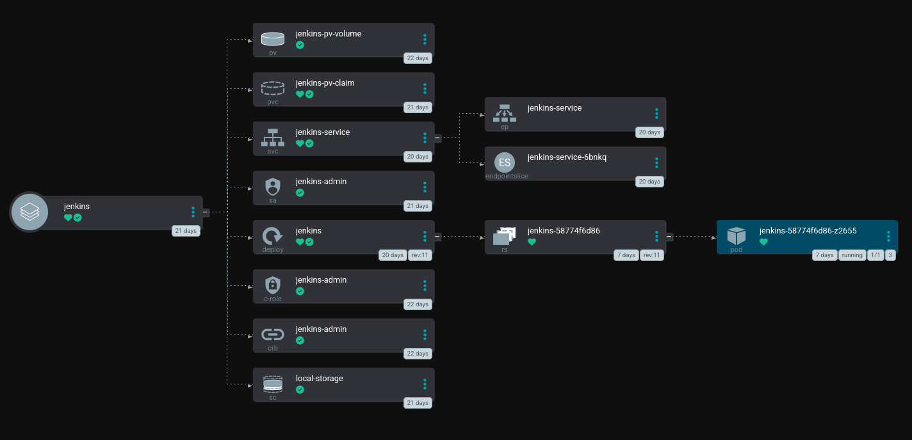

Última atualização: {{ git_revision_date }}

# Ambiente Jenkins

> **“Entrega sob Qualidade.”**

## **Qual ambiente atual do jenkins?**

O jenkins usado nos projetos do Sebrae RR está atualmente implementado no ambiente kubernetes na versão `v1.30.5`

## **Configuração do nó**

| Hardware             | Descrição                                         |
| -------------------- | --------------------------------------------------|
| `RAM`                | :material-check:     16gb                         |
| `HOSTNAME`           | :material-check:     rrsrworker                   |
| `SSD`                | :material-check:     1TB                          |
| `USUÁRIO JENKINS`    | :material-check:     rrsrvworker                  |
| `CONEXÃO`            | :material-check:     SSH-RSA                      |
| `WORKSPACE`          | :material-folder:    /var/lib/jenkins/rrsrvworker |

***
!!! note "Importante"
Caso haja mudanças no nó que roda as automações, o caminho onde os processos são executados deve seguir o mesmo padrão, ou seja, `/var/lib/jenkins/rrsrvworker` com o nome do nó substituído adequadamente.
***

## **Namespace devops-tools**

Todas as ferramentas de devops estão no namespace devops-tools no kubernetes, assim como todas as ferramentas implementadas o jenkins também é gerenciado pelo argocd, segue a estrutura básica do jenkins:

> **Nota:** O argocd é uma ferramenta GitOps para monitarar e gerenciar os recursos kubernetes, e contém documentação própria nesse site.

-   __Persistent Volume (pv-volume)__

    ---
    
    O `PersistentVolume` (PV) é um recurso no Kubernetes que fornece armazenamento persistente. 
    Ele é configurado com capacidade de 15Gi e é associado ao `PersistentVolumeClaim` 
    chamado `jenkins-pv-claim`, dentro do namespace `devops-tools`. A localidade do armazenamento 
    é especificada como um caminho no nó `rrsrvworker`.

-   __Persistent Volume Claim (pv-claim)__

    ---

    O `PersistentVolumeClaim` (PVC) é um pedido de armazenamento que especifica a quantidade de 
    armazenamento necessária. Neste caso, o PVC tem uma solicitação de 3Gi e está associado 
    ao `PersistentVolume` do Jenkins. O namespace é `devops-tools` e o nome do PVC é 
    `jenkins-pv-claim`.

-   __Service Account (service account)__

    ---

    O `ServiceAccount` é usado para fornecer uma identidade para os pods, permitindo que 
    eles acessem recursos no Kubernetes com permissões específicas. O `jenkins-admin` é o 
    `ServiceAccount` usado para o Jenkins dentro do namespace `devops-tools`.

-   __Cluster Role Binding (cluster-role-binding)__

    ---

    O `ClusterRoleBinding` é usado para conceder permissões a um `ServiceAccount` em um cluster 
    Kubernetes. Neste caso, ele vincula o `jenkins-admin` ao `ClusterRole` `jenkins-admin`, 
    permitindo que o Jenkins tenha permissões de administrador no cluster Kubernetes.

-   __Jenkins Deployment__

    ---

    O `Deployment` do Jenkins define como o Jenkins será executado dentro do cluster Kubernetes. 
    Ele especifica uma réplica, que indica a quantidade de pods Jenkins a serem executados. O Jenkins 
    será executado no namespace `devops-tools` com a imagem `jenkins/jenkins:lts`. 
    A configuração inclui variáveis de ambiente como `JENKINS_OPTS` para definir as portas HTTP/HTTPS 
    e informações de SSL, além de `JAVA_OPTS` para ajustes de certificados SSL. 
    O deployment monta volumes persistentes para dados do Jenkins e configura um Secret TLS para SSL.

***
!!! note "Importante"
Todos os arquivos yamls atualizados do jenkins ou qualquer outra aplicação, podem e devem ser visualizados no dashboard do argocd
***

