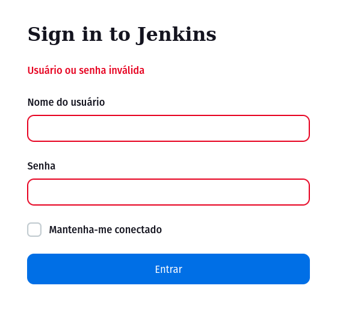

Última atualização: {{ git_revision_date }}

> **“Entrega sob Qualidade.”**

## **Usuário LDAP não reconhecido após reiniciar o jenkins**

A rota `restart` quando chamada no jenkins inicia o processo de reinicialização. É possível que após esse processo o jenkins não autentifique 
o usuário LDAP, apenas o usuário local admin.



### O que fazer nesse caso?

??? Solução_1

    É extramamente normal assim que reiniciar o jenkins não autenticar o usuário LDAP, pois esse 
    tipo de autentição é realizado por um plugin que ainda vai ser carregado após reiniciar o jenkins, 
    portanto limpe os caches, mude de navegador, limpe os cookies e faça o login novamente.


??? Solução_2

    Em casos mais complexos, é necessário desativar a autenticação LDAP no config.xml do jenkins,

    ```xml
    <useSecurity>true</useSecurity>
        <authorizationStrategy class="com.michelin.cio.hudson.plugins.rolestrategy.RoleBasedAuthorizationStrategy">
            <permissionTemplates/>
            <roleMap type="slaveRoles"/>
            <roleMap type="projectRoles"/>
            <roleMap type="globalRoles">
            <role name="Observador" pattern=".*">
                <permissions>
                <permission>hudson.model.Item.Read</permission>
                <permission>jenkins.metrics.api.Metrics.HealthCheck</permission>
                <permission>jenkins.metrics.api.Metrics.View</permission>
                <permission>jenkins.metrics.api.Metrics.ThreadDump</permission>
                <permission>hudson.model.View.Read</permission>
                </permissions>
                <assignedSIDs/>
            </role>
            <role name="admin" pattern=".*">
                <permissions>
                <permission>hudson.model.Hudson.Administer</permission>
                </permissions>
                <assignedSIDs>
                <sid type="GROUP">authenticated</sid>
                <sid type="USER">rodrigo.lacan</sid>
                <sid type="GROUP">RR.UTIC</sid>
                </assignedSIDs>
            </role>
            </roleMap>
        </authorizationStrategy>
    ```
    o xml a baixo configura o jenkins para logar com usuários do banco interno do jenkins

    ```xml
        <useSecurity>true</useSecurity>
            <authorizationStrategy class="com.michelin.cio.hudson.plugins.rolestrategy.RoleBasedAuthorizationStrategy">
            <permissionTemplates/>
            <roleMap type="slaveRoles"/>
            <roleMap type="projectRoles"/>
            <roleMap type="globalRoles">
                <role name="admin" pattern=".*">
                    <permissions>
                        <permission>hudson.model.Hudson.Administer</permission>
                        <permission>hudson.model.Item.Read</permission>
                        <permission>jenkins.metrics.api.Metrics.HealthCheck</permission>
                        <permission>jenkins.metrics.api.Metrics.View</permission>
                        <permission>jenkins.metrics.api.Metrics.ThreadDump</permission>
                        <permission>hudson.model.View.Read</permission>
                    </permissions>
                    <assignedSIDs>
                        <sid type="USER">rodrigo.lacan</sid>
                    </assignedSIDs>
                </role>
            </roleMap>
        </authorizationStrategy>
        <securityRealm class="hudson.security.HudsonPrivateSecurityRealm">
            <disableSignup>true</disableSignup>
            <enableCaptcha>false</enableCaptcha>
        </securityRealm>
    ```

