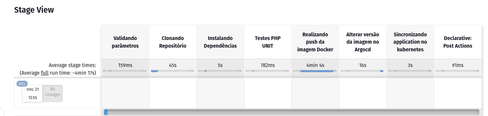

Última atualização: {{ git_revision_date }}

# Pipeline Projeto Conectabiz em ambiente de homologação

> **“Entrega sob Qualidade.”**

## **O que é**

Um **pipeline** no Jenkins é uma sequência de etapas que definem o fluxo de trabalho de CI/CD para um projeto. Ele pode ser composto por uma série de ações como:

- **Construção** do código (compilação, empacotamento, etc.)
- **Testes** automatizados (unitários, integração, etc.)
- **Deploy** (publicação do código em ambientes de desenvolvimento, teste ou produção)

Essas etapas são organizadas de forma sequencial ou paralela, permitindo que os processos de desenvolvimento sejam executados de maneira automática, rápida e eficiente.

## Tipo de Pipeline usado
- :material-play-circle: **Script Pipeline**: ideal para maior flexibilidade e costumização.


## **Etapas**


### Jenkins Pipeline: Explicação das Etapas

Este pipeline foi configurado para realizar o build, push de uma imagem Docker para o Harbor, marcar versões de imagens com labels específicas e realizar atualizações no ArgoCD. Abaixo estão as etapas (**stages**) detalhadas:

#### 1. **Validando parâmetros**
   - **Objetivo**: Garantir que os parâmetros necessários, como as tags do Docker (`NEW_DOCKER_TAG` e `OLD_DOCKER_TAG`), estejam corretos.
   - **Verificação**: O pipeline verifica se a tag da nova imagem segue o formato de versão semântico (por exemplo, `v1.0.0`).

#### 2. **Clonando Repositório**
   - **Objetivo**: Clonar o repositório Git necessário para o pipeline.
   - **Comando**:
     ```bash
     git clone -b dev <repositório>
     ```

#### 3. **Instalando Dependências**
   - **Objetivo**: Instalar as dependências do projeto.
   - **Comando**:
     ```bash
     composer install
     ```

#### 4. **Testes PHP UNIT**
   - **Objetivo**: Executar os testes automatizados do projeto para garantir que o código está funcionando corretamente.
   - **Comando**:
     ```bash
     php artisan test
     ```
     > **Nota**: Se os testes falharem, o pipeline falha automaticamente.

#### 5. **Realizando push da imagem Docker**
   - **Objetivo**: Criar, marcar e empurrar a imagem Docker para o Harbor.
   - **Comandos**:
     1. Cria uma nova imagem Docker com a tag fornecida:
        ```bash
        docker buildx build --tag <tag_da_imagem> .
        ```
     2. Marca a imagem com a nova tag e faz o push para o repositório Docker no Harbor:
        ```bash
        docker push <harbor_repository>/<image>:<tag>
        ```
     3. Exclui as imagens locais para liberar espaço:
        ```bash
        docker rmi <image_id>
        ```

   - **Labels**:
     - Se a tag antiga (`OLD_DOCKER_TAG`) for fornecida, marca a imagem antiga como "Deprecated" no Harbor e a nova como "Last Stable Version".

#### 6. **Alterar versão da imagem no ArgoCD**
   - **Objetivo**: Atualizar o arquivo de configuração do ArgoCD com a nova versão da imagem Docker.
   - **Comandos**:
     1. Clona o repositório de configuração do ArgoCD:
        ```bash
        git clone <repositório_argo_cd>
        ```
     2. Atualiza a versão da imagem no arquivo `deployment.yaml`.
     3. Faz commit e push das alterações para o repositório Git:
        ```bash
        git commit -m "Atualizar versão da imagem Docker"
        git push origin <branch>
        ```
     4. Realiza o merge da branch `dev` para `main` e envia as alterações para o repositório:
        ```bash
        git merge dev
        git push origin main
        ```

#### 7. **Sincronizando application no Kubernetes**
   - **Objetivo**: Sincronizar a aplicação no ArgoCD e Kubernetes.
   - **Comandos**:
     1. Faz login no ArgoCD utilizando credenciais armazenadas:
        ```bash
        argocd login <argo_cd_url>
        ```
     2. Sincroniza a aplicação `conectabiz-homolog` no Kubernetes:
        ```bash
        argocd app sync conectabiz-homolog
        ```

# Pós-execução
   - **Sempre**: O pipeline sempre exibe uma mensagem de conclusão.
   - **Falha**: Se o pipeline falhar em qualquer etapa, exibe uma mensagem de erro indicando falha na execução.

> **Nota**: Este pipeline é ideal para automação de CI/CD em um ambiente de homologação, integrando Docker, Git, ArgoCD e Kubernetes.


