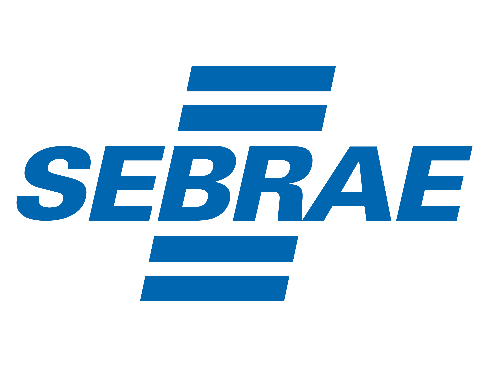

# Wiki de Tecnologia - Sebrae RR

## Bem-vindo à Wiki de Documentação Tecnológica do Sebrae RR

Este site foi desenvolvido para servir como uma wiki com documentações detalhadas sobre as ferramentas e projetos de tecnologia implantados pela Unidade de Tecnologia e Informações Corporativas (UTIC) do Sebrae Roraima (RR). Aqui, você encontrará informações abrangentes sobre cada uma das soluções implementadas, desde ferramentas de CI/CD até plataformas de contêinerização e orquestração, bem como práticas recomendadas e lições aprendidas.

### Objetivo da Wiki

Esta wiki tem como objetivo ser uma referência prática e acessível para todos os analistas, desenvolvedores e colaboradores que desejam entender melhor as tecnologias que sustentam os serviços do Sebrae RR. Promovendo a continuidade e a eficiência nos nossos projetos de tecnologia.

> **Isaac Newton**  
> "Se vi mais longe, foi por estar sobre ombros de gigantes."

## Para quem esta Wiki foi feita

Este site é ideal para:

- **Novos Analistas e Desenvolvedores**: que precisam entender o contexto, as ferramentas e os processos utilizados pelo Sebrae RR.
- **Equipes de Suporte e Infraestrutura**: que desejam acessar rapidamente manuais e boas práticas sobre nossos projetos.
- **Colaboradores Interessados em Tecnologia**: que desejam compreender melhor a arquitetura tecnológica do Sebrae RR e como nossos projetos são mantidos.

### Estrutura das Documentações

As documentações seguem uma estrutura comum, sendo adicionado especificidades conforme a necessidade

- **Informações sobre a ferramenta**: Um breve detalhamento sobre a função da ferramenta no nosso ambiente.
- **Configuração do Ambiente**: Instruções detalhadas para instalação e configuração de cada ferramenta.
- **Soluções de Problemas Comuns**: Um guia de solução de problemas para agilizar a resolução de desafios técnicos.
- **Notas/Observações**: Notas técnicas ou observações importantes sobre cada ferramenta.

## Como Contribuir

Para colaboradores que desejam contribuir com a atualização ou adição de novas documentações, entre em contato com a equipe da UTIC. O conhecimento compartilhado aqui é vital para o fortalecimento do nosso ecossistema tecnológico.

---

## Contato

Caso precise de mais informações ou tenha dúvidas sobre as documentações, entre em contato com a equipe UTIC do Sebrae RR:

- 📧 E-mail: utic@rr.sebrae.com.br
- 🌐 Website: [Portal de negócios sebrae](https://portaldenegociosebrae.com.br/home)

---

**Sebrae RR** — Promovendo o Desenvolvimento Tecnológico em Roraima
